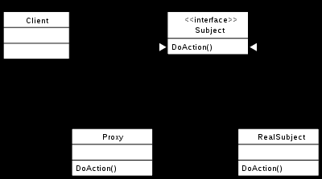

# 设计模式

Design patterns can be divided into three categories:
creational,structural and behavioral. some benefits of using design patterns are:
1: design patterns are already defined and provides industry standard approach to solve a recurring problems. so it can
save time 2: Using design patterns can promote reusability that lead to more robust and highly maintainable code.

Proxy Pattern

proxy provide a surrogate or place holder for another object to control access to it or enhance

The key differences between proxy and adapter pattern :
> 1. Adapter provides a different interface to its subject. Proxy provides the same.
> 2. Adapter is meant to change the interface of an existing object.

Adapter It allows two unrelated or imcompatible interfaces to work together.
