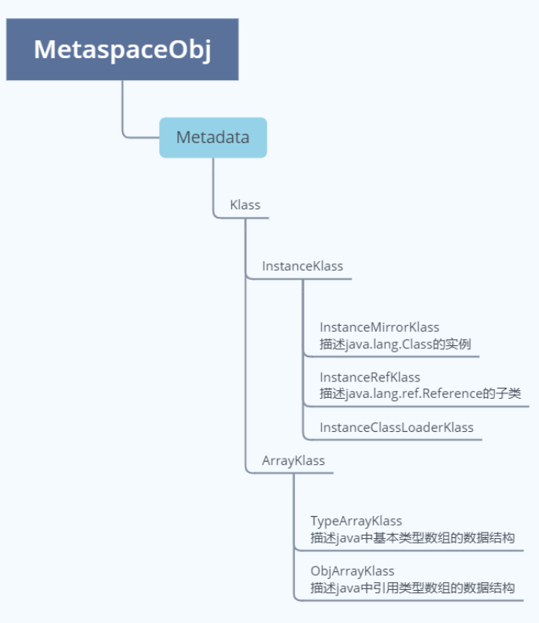

# JVM⼏⼤模块：
1、类加载器⼦系统
2、内存模
3、执⾏引
4、垃圾收集器
5、JIT(热点代码缓)

# Klass模型

klass模型是什么
* java类在JVM中的存在形式
* java类->c++的类 klass

类的元信息是存储在原空间的

普通的Java类在JVM中对应的是instanceKlass类的实例

   1.InstanceMirrorKlass：⽤于表示java.lang.Class，Java代码中获取到的Class对象，实际上就是这个
      C++类的实例，存储在堆区，学名镜像类，静态属性存储在堆区，挂在镜像类上

2. InstanceRefKlass：⽤于表示java/lang/ref/Reference类的⼦类
3. InstanceClassLoaderKlass：⽤于遍历某个加载器加载的类

java中的数组不是静态数据类型，是动态数据类型，是运行期生成的，java数组的元信息用ArrayKlass子类来表示

# 类加载的过程

## 加载

1. 解析成运⾏时数据，即instanceKlass实例，存放在⽅法区
2. 在堆区⽣成该类的Class对象，即instanceMirrorKlass实例

## 验证

## 准备

为静态变量分配内存、赋初值

如果被final修饰，在编译的时候会给属性添加ConstantValue属性，准备阶段直接完成赋值，即没有赋初值这⼀步

## 解析

将常量池中的符号引⽤（静态常量池的索引）转为直接引⽤（运行时常量池 内存地址）

解析后的信息存储在ConstantPoolCache类实例中

1、类或接⼝的解析
2、字段解析
3、⽅法解析
4、接⼝⽅法解析

常量池：
* 1、静态常量池
* 2、运⾏时常量池
* 3、字符串常量池

何时解析

1. 加载阶段解析常量池（静态常量池）

2. 用的时候（运行时常量池）

   

## 初始化

执⾏静态代码块（ clinit），完成静态变量的赋值
静态字段、静态代码段，字节码层⾯会⽣成clinit⽅法

1. 如果没有静态属性，静态代码段，生成的字节码文件中就没有clinit方法快
2. final修饰符不会在clinit方法块中提现(需要动态计算的除外)
3. 一个字节码文件只有一个clinit方法块
4. clinit方法块中生成的代码顺序与JAVA代码的顺序是一致的，这个会影响最终结果

***<u>类初始化是线程安全的，存在死锁的情况</u>***
这个锁是JVM级别的，不能java级别的，所以在jconsole 是查看不到死锁的， HSDB（Deadlock detect）也查看不了

# HSDB使用

如何通过HSDB查看⼀个Java类对应的C++类（⾮数组类）
* 1、通过类向导
* 2、通过对象