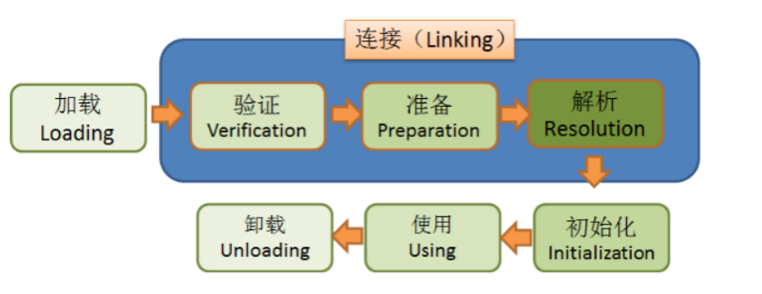

# JVM⼏⼤模块：

1、类加载器⼦系统 2、内存模 3、执⾏引 4、垃圾收集器 5、JIT(热点代码缓存)

# 目的：

1. java代码运行的本质
2. JVM调优

# Klass模型


klass模型是什么

* java类在JVM中的存在形式
* java类->c++的类 klass

类的元信息是存储在原空间的

普通的Java类在JVM中对应的是instanceKlass类的实例

一个普通的对象加载JVM中会生成下面几个类 非数组

1. InstanceKlass 普通的类在JVM中对应C++的类 存放在方法区，存放的是类的元信息（MetaInfo） 如：访问权限，类的属性等
2. InstanceMirrorKlass Java代码中获取到的Class对象，实际上就是这个C++类的实例，存储在堆区，学名镜像类，静态属性存储在堆区，挂在镜像类上

数组 1.基本数据数组 （TypeArrayKlass） boolean byte char short int float long double 2.引用类型数组（ObjArrayKlass）

2. InstanceRefKlass：⽤于表示java/lang/ref/Reference类的⼦类
3. InstanceClassLoaderKlass：⽤于遍历某个加载器加载的类

java中的数组不是静态数据类型，是动态数据类型，是运行期生成的，java数组的元信息用ArrayKlass子类来表示

# HSDB使用

如何通过HSDB查看⼀个Java类对应的C++类（⾮数组类）
`java -cp $JAVA_HOME/lib/sa-jdi.jar sun.jvm.hotspot.HSDB`

* 1、通过类向导

* 2、通过对象

# 类加载的过程



## 加载

1. 解析成运⾏时数据，即instanceKlass实例，存放在⽅法区
2. 在堆区⽣成该类的Class对象，即instanceMirrorKlass实例

## 验证

## 准备

为静态变量分配内存、赋初值

如果被final修饰，在编译的时候会给属性添加ConstantValue属性，准备阶段直接完成赋值，即没有赋初值这⼀步

## 解析

将常量池中的符号引⽤（静态常量池的索引）转为直接引⽤（运行时常量池 内存地址）

解析后的信息存储在ConstantPoolCache类实例中

1、类或接⼝的解析 2、字段解析 3、⽅法解析 4、接⼝⽅法解析

常量池：

* 1、静态常量池
* 2、运⾏时常量池
* 3、字符串常量池

何时解析

1. 加载阶段解析常量池（静态常量池）

2. 用的时候（运行时常量池）

## 初始化

执⾏静态代码块（ clinit），完成静态变量的赋值 静态字段、静态代码段，字节码层⾯会⽣成clinit⽅法

1. 如果没有静态属性，静态代码段，生成的字节码文件中就没有clinit方法快
2. final修饰符不会在clinit方法块中提现(需要动态计算的除外)
3. 一个字节码文件只有一个clinit方法块
4. clinit方法块中生成的代码顺序与JAVA代码的顺序是一致的，这个会影响最终结果

***<u>类初始化是线程安全的，存在死锁的情况</u>***
这个锁是JVM级别的，不能java级别的，所以在jconsole 是查看不到死锁的， HSDB（Deadlock detect）也查看不了

## 使用

## 卸载

*

# 类加载器


- 启动（Bootstrap）类加载器 启动类加载器主要加载的是JVM自身需要的类，这个类加载使用C++语言实现的，是虚拟机自身的一部分，它负责将 `<JAVA_HOME>/lib`路径下的核心类库或`-Xbootclasspath`
  参数指定的路径下的jar包加载到内存中

- 扩展（Extension）类加载器 扩展类加载器是指Sun公司(已被Oracle收购)实现的sun.misc.Launcher$ExtClassLoader类，由Java语言实现的，是Launcher的静态内部类，它负责加载<
  JAVA_HOME>/lib/ext目录下或者由系统变量-Djava.ext.dir指定位路径中的类库

- 系统（System）类加载器 也称应用程序加载器是指 Sun公司实现的sun.misc.Launcher$AppClassLoader。它负责加载系统类路径java -classpath或-D java.class.path
  指定路径下的类库，也就是我们经常用到的classpath路径，开发者可以直接使用系统类加载器，一般情况下该类加载是程序中默认的类加载器，通过ClassLoader#getSystemClassLoader()方法可以获取到该类加载器

```
启动类加载器，由C++实现，没有父类。

拓展类加载器(ExtClassLoader)，由Java语言实现，父类加载器为null

系统类加载器(AppClassLoader)，由Java语言实现，父类加载器为ExtClassLoader

自定义类加载器，父类加载器肯定为AppClassLoader。
```

自定义类加载器的情况

- 当class文件不在ClassPath路径下，默认系统类加载器无法找到该class文件，在这种情况下我们需要实现一个自定义的ClassLoader来加载特定路径下的class文件生成class对象。

- 当一个class文件是通过网络传输并且可能会进行相应的加密操作时，需要先对class文件进行相应的解密后再加载到JVM内存中，这种情况下也需要编写自定义的ClassLoader并实现相应的逻辑。

- 当需要实现热部署功能时(一个class文件通过不同的类加载器产生不同class对象从而实现热部署功能)，需要实现自定义ClassLoader的逻辑。

## 双亲委派

工作原理的是，如果一个类加载器收到了类加载请求，它并不会自己先去加载，而是把这个请求委托给父类的加载器去执行，如果父类加载器还存在其父类加载器，则进一步向上委托，依次递归，请求最终将到达顶层的启动类加载器，如果父类加载器可以完成类加载任务，就成功返回，倘若父类加载器无法完成此加载任务，子加载器才会尝试自己去加载（凭实力坑爹）,线程上下文类加载器

- 优势

  好处是Java类随着它的类加载器一起具备了一种带有优先级的层次关系，通过这种层级关可以避免类的重复加载，当父亲已经加载了该类时，就没有必要子ClassLoader再加载一次

  其次是考虑到安全因素，java核心api中定义类型不会被随意替换

- 缺点

  子类加载器可以使用父类加载器已经加载的类，而父类加载器无法使用子类加载器已经加载的

  SPI实现的Java类一般是由AppClassLoader来加载的。BootstrapClassLoader是无法找到 SPI
  的实现类的，因为它只加载Java的核心库。它也不能代理给AppClassLoader，因为它是最顶层的类加载器。

可以通过Thread.currentThread().getClassLoader()和Thread.currentThread().getContextClassLoader()获取线程上下文类加载器

### SPI

与SpringIOC集成:

1. 仅仅使用Spring IOC功能。

```java
public class Mall {
	
	@Resource
	private OrderService orderService;
	
	public void doSomething(){
		System.out.println("握手");
	}
	public void getReward(){
		orderService.get();
	}
}
```

只是SPI加载了这个类可以通过AutowireCapableBeanFactory 进行注册

```java
@Service
public class OrderCreate{
	
	@Resource
	private AutowireCapableBeanFactory beanFactory;
	
	public void test(){
		Mall mall = new Mall();
		beanFactory.autowireBean(mall);
		mall.getReward();
	}
}
```

2. 动态的交给Spring管理

可以参考

```http
https://github.com/SongranZhang/spi-imp
```

# 类加载器加载的类如何存储

