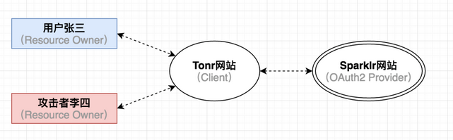
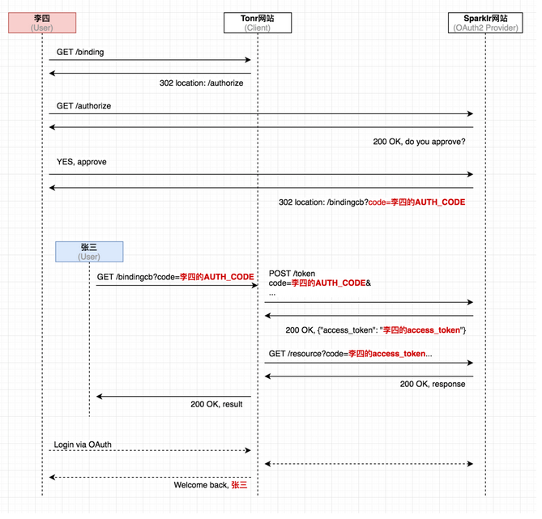
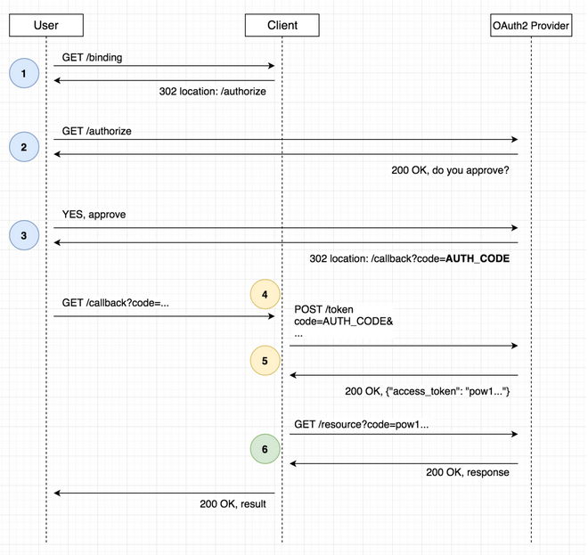
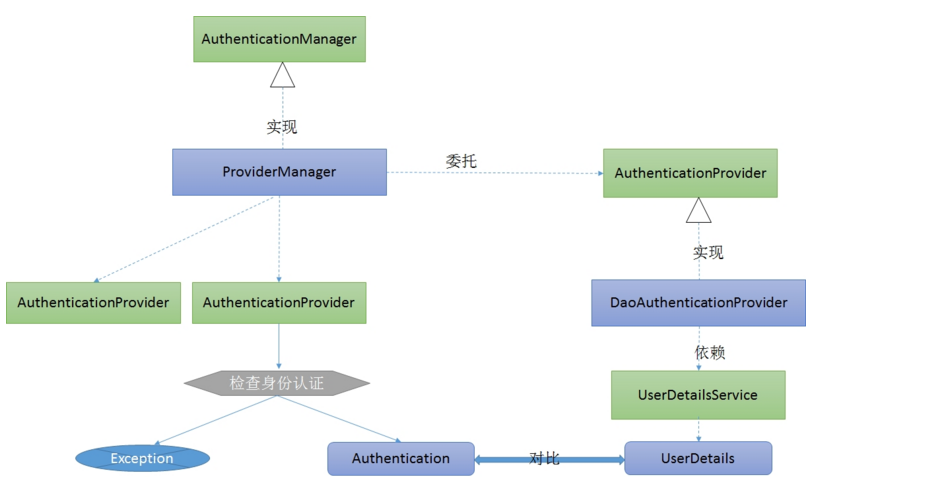

<u>*部分截图和内容来自于互联网，如果侵权请联系*</u>

# OAuth2的原理

## OAuth2.0的典型模型

# CSRF攻击流程

## 概念

假设有用户张三，攻击者李四，第三方Web应用Tonr（它集成了第三方社交账号登录，并且允许用户将社交账号和Tonr中的账号进行绑定），

以及OAuth2服务提供者Sparklr。


从整体上来看，这次攻击的时序图应该是下面这个样子的

Step 1. 攻击者李四登录Tonr网站，并且选择绑定自己的Sparklr账号 Step 2. Tonr网站将李四重定向到Sparklr，由于他之前已经登录过Sparklr，所以Sparklr直接向他显示是否授权Tonr访问的页面
Step 3. 李四在点击”同意授权“之后，截获Sparklr服务器返回的含有Authorization code参数的HTTP响应 Step 4.
李四精心构造一个Web页面，它会触发Tonr网站向Sparklr发起令牌申请的请求，<br>             而这个请求中的Authorization Code参数正是上一步截获到的code Step 5.
李四将这个Web页面放到互联网上，等待或者诱骗受害者张三来访问 Step 6. 张三之前登录了Tonr网站，只是没有把自己的账号和其他社交账号绑定起来。<br>
在张三访问了李四准备的这个Web页面，令牌申请流程在张三的浏览器里被顺利触发，<br>
Tonr网站从Sparklr那里获取到access_token，但是这个token以及通过它进一步获取到的用户信息却都是攻击者李四的。 Step 7.
Tonr网站将李四的Sparklr账号同张三的Tonr账号关联绑定起来，从此以后，<br>            李四就可以用自己的Sparklr账号通过OAuth登录到张三在Tonr网站中的账号，堂而皇之的冒充张三的身份执行各种操作。

## 防御办法

授权码模式<br>


UserDetailsService在身份认证中的作用<br>


```
/oauth/authorize：授权端点。
/oauth/token：令牌端点。
/oauth/confirm_access：用户确认授权提交端点。
/oauth/error：授权服务错误信息端点。
/oauth/check_token：用于资源服务访问的令牌解析端点。
/oauth/token_key：提供公有密匙的端点，如果你使用JWT令牌的话
```

## 授权码模式

```
http://localhost:8080/oauth/authorize?client_id=client_test&response_type=code&scope=all
http://localhost:8080/oauth/token?client_id=client_test&client_secret=test123456&grant_type=authorization_code&code=6TQ2jp
http://localhost:8080/oauth/check_token?token=3cdce268-1a5a-4f3e-90f5-92dc1f1930a7
```

## 密码模式

```
http://localhost:8080/oauth/token?client_id=client_test&client_secret=test123456&username=admin&password=123456&grant_type=password&scope=all
```

建表语句

```sql
SET NAMES utf8mb4;
SET FOREIGN_KEY_CHECKS = 0;

-- ----------------------------
-- Table structure for oauth_access_token
-- ----------------------------
DROP TABLE IF EXISTS `oauth_access_token`;
CREATE TABLE `oauth_access_token`  (
  `token_id` varchar(255) CHARACTER SET utf8 COLLATE utf8_general_ci NULL DEFAULT NULL COMMENT '加密的access_token的值',
  `token` longblob NULL COMMENT 'OAuth2AccessToken.java对象序列化后的二进制数据',
  `authentication_id` varchar(255) CHARACTER SET utf8 COLLATE utf8_general_ci NULL DEFAULT NULL COMMENT '加密过的username,client_id,scope',
  `user_name` varchar(255) CHARACTER SET utf8 COLLATE utf8_general_ci NULL DEFAULT NULL COMMENT '登录的用户名',
  `client_id` varchar(255) CHARACTER SET utf8 COLLATE utf8_general_ci NULL DEFAULT NULL COMMENT '客户端ID',
  `authentication` longblob NULL COMMENT 'OAuth2Authentication.java对象序列化后的二进制数据',
  `refresh_token` varchar(255) CHARACTER SET utf8 COLLATE utf8_general_ci NULL DEFAULT NULL COMMENT '加密的refresh_token的值'
) ENGINE = InnoDB CHARACTER SET = utf8 COLLATE = utf8_general_ci ROW_FORMAT = Dynamic;

-- ----------------------------
-- Table structure for oauth_approvals
-- ----------------------------
DROP TABLE IF EXISTS `oauth_approvals`;
CREATE TABLE `oauth_approvals`  (
  `userId` varchar(255) CHARACTER SET utf8 COLLATE utf8_general_ci NULL DEFAULT NULL COMMENT '登录的用户名',
  `clientId` varchar(255) CHARACTER SET utf8 COLLATE utf8_general_ci NULL DEFAULT NULL COMMENT '客户端ID',
  `scope` varchar(255) CHARACTER SET utf8 COLLATE utf8_general_ci NULL DEFAULT NULL COMMENT '申请的权限范围',
  `status` varchar(10) CHARACTER SET utf8 COLLATE utf8_general_ci NULL DEFAULT NULL COMMENT '状态（Approve或Deny）',
  `expiresAt` datetime(0) NULL DEFAULT NULL COMMENT '过期时间',
  `lastModifiedAt` datetime(0) NULL DEFAULT NULL COMMENT '最终修改时间'
) ENGINE = InnoDB CHARACTER SET = utf8 COLLATE = utf8_general_ci ROW_FORMAT = Dynamic;

-- ----------------------------
-- Table structure for oauth_client_details
-- ----------------------------
DROP TABLE IF EXISTS `oauth_client_details`;
CREATE TABLE `oauth_client_details`  (
  `client_id` varchar(255) CHARACTER SET utf8 COLLATE utf8_general_ci NOT NULL COMMENT '客户端ID',
  `resource_ids` varchar(255) CHARACTER SET utf8 COLLATE utf8_general_ci NULL DEFAULT NULL COMMENT '资源ID集合,多个资源时用逗号(,)分隔',
  `client_secret` varchar(255) CHARACTER SET utf8 COLLATE utf8_general_ci NULL DEFAULT NULL COMMENT '客户端密匙',
  `scope` varchar(255) CHARACTER SET utf8 COLLATE utf8_general_ci NULL DEFAULT NULL COMMENT '客户端申请的权限范围',
  `authorized_grant_types` varchar(255) CHARACTER SET utf8 COLLATE utf8_general_ci NULL DEFAULT NULL COMMENT '客户端支持的grant_type',
  `web_server_redirect_uri` varchar(255) CHARACTER SET utf8 COLLATE utf8_general_ci NULL DEFAULT NULL COMMENT '重定向URI',
  `authorities` varchar(255) CHARACTER SET utf8 COLLATE utf8_general_ci NULL DEFAULT NULL COMMENT '客户端所拥有的Spring Security的权限值，多个用逗号(,)分隔',
  `access_token_validity` int(11) NULL DEFAULT NULL COMMENT '访问令牌有效时间值(单位:秒)',
  `refresh_token_validity` int(11) NULL DEFAULT NULL COMMENT '更新令牌有效时间值(单位:秒)',
  `additional_information` varchar(255) CHARACTER SET utf8 COLLATE utf8_general_ci NULL DEFAULT NULL COMMENT '预留字段',
  `autoapprove` varchar(255) CHARACTER SET utf8 COLLATE utf8_general_ci NULL DEFAULT NULL COMMENT '用户是否自动Approval操作'
) ENGINE = InnoDB CHARACTER SET = utf8 COLLATE = utf8_general_ci ROW_FORMAT = Dynamic;

-- ----------------------------
-- Table structure for oauth_client_token
-- ----------------------------
DROP TABLE IF EXISTS `oauth_client_token`;
CREATE TABLE `oauth_client_token`  (
  `token_id` varchar(255) CHARACTER SET utf8 COLLATE utf8_general_ci NULL DEFAULT NULL COMMENT '加密的access_token值',
  `token` longblob NULL COMMENT 'OAuth2AccessToken.java对象序列化后的二进制数据',
  `authentication_id` varchar(255) CHARACTER SET utf8 COLLATE utf8_general_ci NULL DEFAULT NULL COMMENT '加密过的username,client_id,scope',
  `user_name` varchar(255) CHARACTER SET utf8 COLLATE utf8_general_ci NULL DEFAULT NULL COMMENT '登录的用户名',
  `client_id` varchar(255) CHARACTER SET utf8 COLLATE utf8_general_ci NULL DEFAULT NULL COMMENT '客户端ID'
) ENGINE = InnoDB CHARACTER SET = utf8 COLLATE = utf8_general_ci ROW_FORMAT = Dynamic;

-- ----------------------------
-- Table structure for oauth_code
-- ----------------------------
DROP TABLE IF EXISTS `oauth_code`;
CREATE TABLE `oauth_code`  (
  `code` varchar(255) CHARACTER SET utf8 COLLATE utf8_general_ci NULL DEFAULT NULL COMMENT '授权码(未加密)',
  `authentication` blob NULL COMMENT 'AuthorizationRequestHolder.java对象序列化后的二进制数据'
) ENGINE = InnoDB CHARACTER SET = utf8 COLLATE = utf8_general_ci ROW_FORMAT = Dynamic;

-- ----------------------------
-- Table structure for oauth_refresh_token
-- ----------------------------
DROP TABLE IF EXISTS `oauth_refresh_token`;
CREATE TABLE `oauth_refresh_token`  (
  `token_id` varchar(255) CHARACTER SET utf8 COLLATE utf8_general_ci NULL DEFAULT NULL COMMENT '加密过的refresh_token的值',
  `token` longblob NULL COMMENT 'OAuth2RefreshToken.java对象序列化后的二进制数据 ',
  `authentication` longblob NULL COMMENT 'OAuth2Authentication.java对象序列化后的二进制数据'
) ENGINE = InnoDB CHARACTER SET = utf8 COLLATE = utf8_general_ci ROW_FORMAT = Dynamic;

SET FOREIGN_KEY_CHECKS = 1;


#插入模拟业务数据
INSERT INTO `my_test`.`oauth_client_details`(`client_id`, `resource_ids`, `client_secret`, `scope`, `authorized_grant_types`, `web_server_redirect_uri`, `authorities`, `access_token_validity`, `refresh_token_validity`, `additional_information`, `autoapprove`) VALUES ('client_test', 'order,auth', 'test123456', 'all', 'authorization_code,password,client_credentials,implicit,refresh_token', 'http://www.baidu.com', NULL, 10000, 10000, NULL, NULL);

```